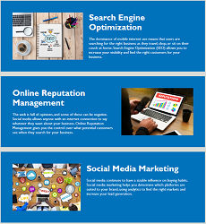
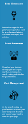

# Horiseon webpage

This is the webpage of our marketing agency - **Horiseon Social Solution Services**.  

The webpage is designed to help visitors gain an insight into our services by highlighting their features and benefits. It can be accessed via the URL: https://cl-lee.github.io/Challenge01_Horiseon-webpage/

## Webpage layout

There are five major components of the webpage, as displayed from top to bottom on the page.
* The navigation bar
* The header image
* Cards detailing features of Horiseon's services
* A sidebar highlighting benefits of Horiseon's services
* A footer

## Browsing the webpage

* ### The navigation bar

  Upon landing on the webpage, visitors will find our company name **Horiseon** in the top left corner. To the right are three features of our services, visitors can click on any of them to view the corresponding service features details.  
      

* ### Service features cards

  Alternatively, visitors can scroll down the page past the navigation bar. Just below of the header image are cards with details of our service features.  

  *The header image*  
    
    
  *Service features cards*  
  

* ### Sidebar
  
  To the right of the service features cards, visitors can find our service benefits.

    